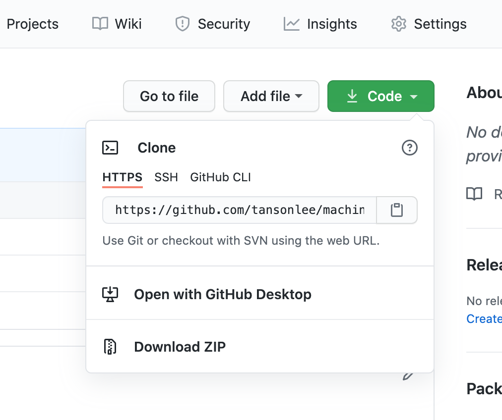
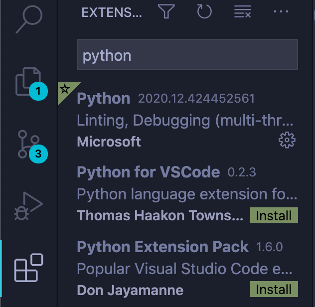
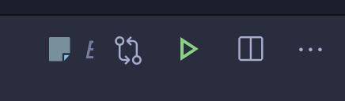
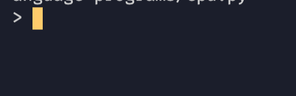

# My Machine Language

## A Machine Language Designed and Implemented my Me

## Table of Contents
1. [Introduction](#introduction)
2. [Operation Code Legend](#operation-code-legend)
    * [Instruction Format](#instruction-format)
	* [Notation](#notation)
	* [Legend](#legend)
3. [Details on the Language](#details)
	* [Instruction Pointer Address](#instruction-pointer-address)
	* [Syntax](#syntax)
	* [Executing Programs](#executing-programs)
4. [Examples](#examples)
    * [Simple Echo Program](#echo-program)
	* [Cumulative Sum with BST](#cumulative-sum-program)
	* [Selection Sort](#selection-sort)
5. [How to Get Setup](#getting-setup)
6. [Troubleshooting](#troubleshooting)

## Introduction

This program is based on the Von Neumann Architecture which is a stored program computer, meaing the program is loaded directly into the same RAM that stores data.
This program uses an implementaiton of a CPU requiring a program loader and fetch-evaluation cycle.
It also uses an implemetation of a RAM which can be found here: <br>[RAM Implentation](https://github.com/tansonlee/ram)

## Operation Code Legend

#### Instruction Format

Each instruction is formatted as follows: `XXtttuuuvvv`
* `XX` : 2-digit operation code
* `ttt`: 3-digit target address
* `uuu`: 3-digit source 1 address
* `vvv`: 3-digit source 2 address

#### Notation

* `[x]` means the value stored at address x
* `x` means the address x
* `[x] === y` means the value at address `x` is `y`
* `[x] <- y` means store the value y into address x

#### Legend

|Instruction     |Operation       |Description                                      | 
|----------------|----------------|-------------------------------------------------|
|` 0000000000`   |halt            |`end program`                                    |
|` 1ttt000000`   |read            |`[ttt] <- read`                                  |       
|` 2000uuu000`   |display         |`display <- [uuu]`                               |
|` 3tttuuu000`   |copy            |`[ttt] <- [uuu]`                                 |
|` 4tttuuu000`   |fetch           |`[ttt] <- [[uuu]]`                               |
|` 5tttuuu000`   |store           |`[[ttt]] <- [uuu]`                               |
|` 6ttt000000`   |add1            |`[ttt] <- [ttt] + 1`                             |
|` 7tttuuuvvv`   |add             |`[ttt] <- [uuu] + [vvv]`                         |
|` 8ttt000000`   |subtract1       |`[ttt] <- max([ttt] - 1, 0)`                     |
|` 9tttuuuvvv`   |subtract        |`[ttt] <- max([uuu] - [vvv], 0)`                 |
|`10tttuuuvvv`   |multiply        |`[ttt] <- [uuu] * [vvv]`                         |
|`11tttuuuvvv`   |divide          |`[ttt] <- floor([uuu] / [vvv]) given [vvv] != 0` |
|`12tttuuu000`   |if zero add1    |`[ttt] <- [ttt] + 1 if [uuu] === 0`              |
|`13tttuuuvvv`   |if equal add1   |`[ttt] <- [ttt] + 1 if [uuu] === [vvv]`          |
|`14tttuuuvvv`   |if greater add1 |`[ttt] <- [ttt] + 1 if [uuu] > [vvv]`            |


## Details on the Language

#### Instruction Pointer Address (IPA)
The instruction pointer address (IPA) is stored in RAM usually at address 0. 
The IPA stores the address for the instruction that will be executed.
After every instruction is executed, the IPA increments by 1.
For example, if the IPA stores the value 25 and the value at the address 25 is 0000000000, then 0000000000 will be treated as an instruction which halts the program (since 0000000000 corresponds to the halt operation).
Since the IPA is stored directly into RAM, operations can be performed on it. 
For example, if the IPA is stored at address 0, to skip an instruction, we need to add1 to the value at address 0.
To skip back 10 instructions, we need to subtract 10 from the value at address 0.

#### Syntax
The instructions that will be loaded are represented by a Python list. This means each instruction is seperated my a comma and the entire instruction sequence is enclosed in square brackets.

#### Executing Programms
There are two functions provided for executing programs.

* `run_and_return(instructions, load_address, instruction_pointer_address)` executes the program and returns the RAM in the final state
* `run_and_dump(instructions, load_address, instruction_pointer_address)` executes the program and performs a core dump which prints the contents of the RAM in the final state
* `instructions` is the Python list of instructions that will be loaded into RAM
* `load_address` is the address of the first element of `instructions` the rest of the elements will be loaded sequentially
* `instruction_pointer_address` is the address that will hold the IPA

Commonly, `load_address` and `instruction_pointer_address` are default to 0

Any input will be prompted by ">" and any output will be preceeded with "<".

## Examples

#### Echo program
Simple echo program. The program will be loaded at address 0 and the IPA is 0.

```python
instructions = [
	3, # [0]: IPA, first instruction is at address 3
	0, # [1]: address to store input
	6, # [2]: literal 6 how much to go back in later instruction
	1001000000,  # [1] <- read               | read input and store at address 1 **
	12000001000, # [0] <- [0] + 1 if [1]===0 | if the input is 0, skip 1 instruction 
	6000000000,  # [0] <- [0] + 1            | skip 1 instruction
	0000000000,  # halt                      | end of program
	2000001000,  # display <- [1]            | display [1] which is the input
	9000000002   # [0] = [0] - 6             | go back 6 instructions to **
]

run_and_return(instructions, 0, 0)
```

The output of the program, given an input of 1 200 999 0, is:
```python
> 1
< 1
> 200
< 200
> 999
< 999
> 0
```

#### Cumulative Sum Program

#### Selection Sort

## Getting Setup

1. Downoad the repository by clicking Download ZIP under code.



2. Open the file with a text editor like Visual Studio Code (VS Code).

3. Open the cpu.py file and at the bottom create a variable called instructions and set it as an empty list. Fill the list with the program with each instruction seperated by a comma. Then call the run_and_return function. It should look like:

```python
# program to sum 2 numbers
instructions = [
	3, # [0]: IPA, first instruction is at address 3
	0, # [1]: address to store input 1
	0, # [2]: address to store input 2
	6, # [3]: address to store sum
	1001000000,  # [1] <- read      | read input and store at address 1
	1002000000,  # [2] <- read      | read input and store at address 2
	7003001002,  # [3] <- [1] + [2] | sum the values stored at addresses 1 and 2 and store it in address 3
	2000003000,  # display <- [3]   | display the value stored at address 3
	0000000000  # stop the program
]

run_and_return(instructions, 0, 0)
```

Note that the last value in the list does not have a comma after it.

4. To run the program in VS Code, install an extension called Python. Click the extension page on the left side and search for python. Install the first extension.



5. Go back to the cpu.py file and press the green run button in the top right corner



6. If your program takes input, there will be a prompt at the bottom in the terminal. Type the input there and press enter.



7. Input prompts are represented by ">" and outputs of the program are represented by "<".


## Troubleshooting 